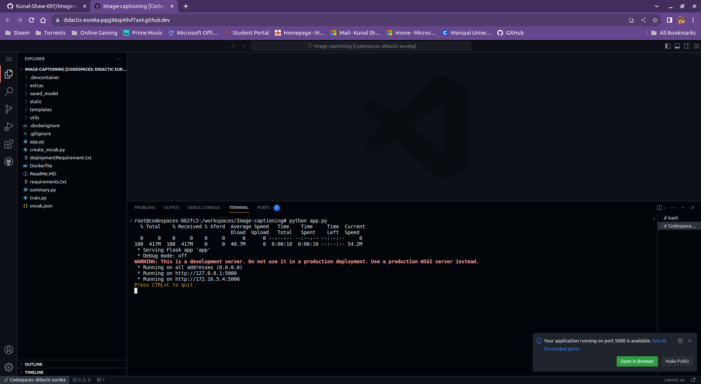
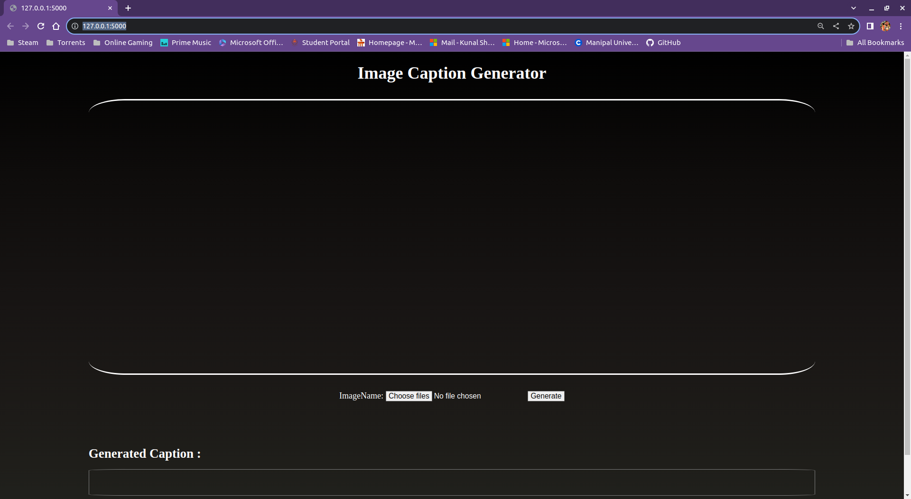

# Info :
<B>Image Captioning</B> refers to producing relevant descriptions for a given image. It is a very difficult task, as it requires knowledge of both Computer Vision and Natural Language Processing topics. This repository present a way to tackle this specific task using a model which is both lightweight and can produce some decent captions (most of the times) for Images. 

The Model along with the Tokenizer and even the vocabulary are all made up from scratch by me, using pyTorch(for model),opencv and numpy(for image processing) and some basic built in python libraries(for creaing vocabulary and Tokenizer).

The model architecture is based upon the <B>Vision Transformer Model (ViT)</B>, which has recently gained a lot of traction in the Computer Vision field.

##

# How to run the code using Github codespace ?

<B>1.</B> Click on <I>"Create Codespace on main"</I> and wait for a few minutes.

##

<B>2.</B> After the codespace is setup, wait for the model weight to finish downloading and click on the <I>"Open in browser"</I> option in the bottom right pop-up.

##

<B>3.</B> This should start the app, insert any image and hopefully the model can generate a decent caption for the given image :)

##

